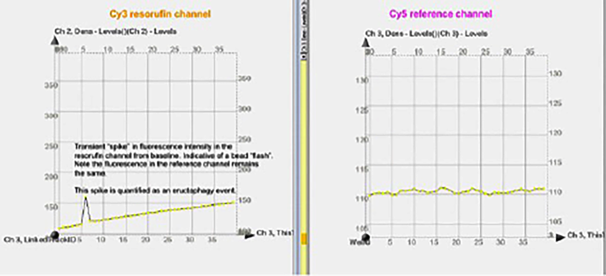

# Pipeline for processing fluorescence data collected in ImageXpress® Micro XLS

SUMMARY

For analysis what we basically need is to be able to track which bead/phagosome (bead within phagosome) is flashing (or not) over time. The program needs to be able to track multiple beads over the length of the imaging period and be able to distinguish between the different beads i.e. bead 1 vs bead 2 vs bead 3 etc. We need a dataset that gives us fluorescence values for each timepoint per bead within the phagosome. These values need to correspond correctly to the same bead within the phagosome. Based on this, we will then see (and calculate) "eructophagy" events as well-separated elevations of "fluorescence intensity" in the Cy3 channel over time, with no elevations in the Cy5 channel.

  

